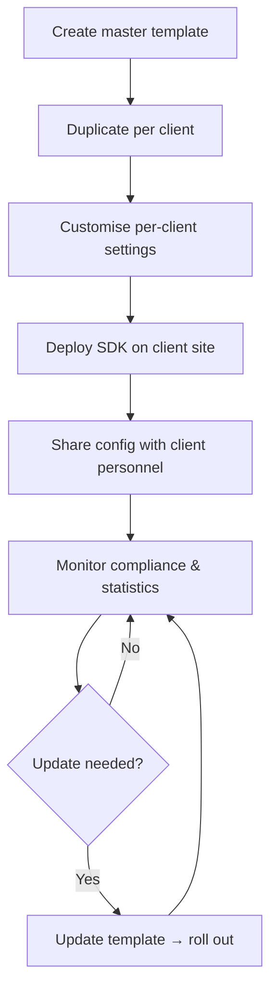

# Agency Guide

This section is for **digital agencies** that deploy and manage Waulter across multiple client websites. The Waulter B2B dashboard serves as your centralised consent management hub — one place to configure, monitor, and update consent banners for all your clients.

## Who this guide is for

| Persona | Description |
|---------|-------------|
| **Agency admins** | Team members who manage Waulter deployments across client websites — creating configurations, rolling out updates, monitoring compliance |
| **Agency developers** | Technical staff implementing the SDK on client sites via GTM or direct script tags |
| **Client personnel** | Client staff who access their own consent configurations via shared access |

## The B2B dashboard as a multi-client hub

The Waulter B2B dashboard is designed for multi-client management:

- **Configuration list** — all client configurations in one view, with status badges (active/inactive) and sharing indicators
- **Partner grouping** — configurations are grouped by partner (client company), making it easy to navigate between clients
- **Quick filters** — filter by status, client, or compliance state
- **Bulk actions** — duplicate and manage configurations efficiently

## Key benefits for agencies

| Benefit | Description |
|---------|-------------|
| **Centralised management** | One dashboard for all client consent configurations — no switching between accounts |
| **Template-based deployment** | Create a master template once, duplicate for each new client in minutes |
| **Batch updates** | Update a template and roll changes across 10, 50, or 100+ clients efficiently |
| **Client self-service** | Share configurations with client personnel for viewing or editing — they see only their own configs |
| **Consistent compliance** | Ensure all clients meet the same compliance standards using standardised templates |
| **Compliance monitoring** | Track detection results and consent rates across all clients from one dashboard |

## Agency workflow overview

### Phase 1 — Template setup

1. Create a [template configuration](templates.md) with your agency's standard settings (purposes, styling, GCM mode, texts).
2. Name it with a `[TEMPLATE]` prefix for clarity.
3. Keep it inactive — it's a blueprint.

### Phase 2 — Client onboarding

1. [Duplicate](templates.md) the template for the new client.
2. Customise domain, branding, and client-specific texts.
3. Deploy the SDK on the client's website (via [GTM](../implementation/gtm/index.md) or [direct script](../implementation/direct/index.md)).
4. Activate the configuration.

### Phase 3 — Client access

1. [Share](sharing.md) the configuration with client personnel.
2. Choose the appropriate role (read-only for monitoring, admin for self-management).
3. The client logs in and sees only their shared configurations.

### Phase 4 — Ongoing management

1. Monitor compliance and statistics across all clients.
2. When updates are needed, use the [batch update workflow](templates.md#batch-update-workflow).
3. Handle [ownership transfers](transfer.md) when client relationships change.

## Section contents

| Page | Description |
|------|-------------|
| [Template Configs & Batch Updates](templates.md) | The core agency workflow: templates, duplication, and batch rollouts |
| [Account Registration & Sharing](sharing.md) | Managing client access: local and global sharing, roles |
| [Transfer of Ownership](transfer.md) | Handing off configurations to clients |
