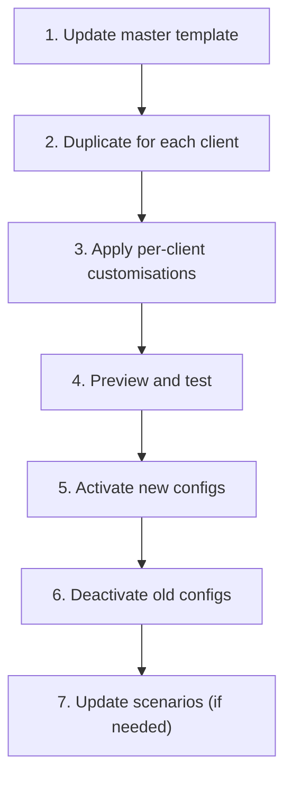

# Template Configs & Batch Updates

The template pattern is the most powerful workflow for agencies managing Waulter across multiple client websites. By maintaining a master "template" configuration, you can standardise settings and roll out updates efficiently.

## Creating a template configuration

1. Create a new configuration in the Waulter dashboard.
2. Name it with a `[TEMPLATE]` prefix — e.g. `[TEMPLATE] Standard EU Banner`.
3. Configure your agency's standard settings:

| Setting | Recommendation |
|---------|---------------|
| **Purposes** | Your standard purpose categories with descriptions |
| **GCM Mode** | Basic or Advanced (your agency's default) |
| **Banner template** | Your preferred layout |
| **Styling** | Agency default colours (clients can override) |
| **Texts** | Default text in all supported languages |
| **Consent durations** | Standard durations (e.g. 90 days for all) |

4. Keep the template configuration **inactive** — it is a blueprint, not a live config.

!!! warning "Never activate a template"
    Template configurations should never be activated. They serve as blueprints. If you accidentally activate a template, deactivate it immediately.

## Template naming conventions

Use clear, descriptive names so templates are instantly recognisable:

| Template name | Use case |
|--------------|----------|
| `[TEMPLATE] Standard EU Banner` | Your default EU template with standard purposes |
| `[TEMPLATE] Advanced GCM` | Template with Advanced GCM mode enabled |
| `[TEMPLATE] Minimal` | Stripped-down template for simple sites (analytics only) |
| `[TEMPLATE v2] Standard EU Banner` | Updated version of the standard template |

See [Naming Conventions](../good-practices/naming-conventions.md) for the full taxonomy.

## Duplicating per client

1. Open the template configuration.
2. Click **Duplicate** / **Copy**.
3. Name the new configuration following the convention: `[PROD] Client Name — domain.com`.
4. Customise client-specific settings:

| Setting | Customise for each client |
|---------|--------------------------|
| **Website URL** | Client's primary domain |
| **Whitelisted domains** | All client domains and subdomains |
| **Styling** | Client brand colours, font, logo |
| **Texts** | Client-specific wording (if different from template) |
| **Legal documents** | Client's Cookie Policy and Privacy Policy links |

5. Preview the configuration to verify appearance.
6. Activate when ready to go live.

## Batch update workflow

When you need to update settings across all (or many) client configurations:

### Step-by-step

1. **Update the template** with the new settings (e.g. new purpose, updated text, GCM mode change).
2. **Duplicate the updated template** for each affected client.
3. **Review each copy** — verify client-specific customisations are preserved. Apply per-client overrides.
4. **Test** each new configuration using the Preview button.
5. **Activate** the new configurations.
6. **Deactivate** the old configurations.
7. **Update SDK IDs** if needed — not required if clients use Scenario IDs (point the scenario to the new configuration).

### Time savings

| Number of clients | Without templates | With template pattern |
|-------------------|------------------|-----------------------|
| 10 | ~2 hours (manual config of each) | ~15 minutes |
| 50 | ~10 hours | ~45 minutes |
| 100 | ~20 hours | ~1.5 hours |

!!! tip "Use Scenario IDs for zero-downtime updates"
    If clients use a **Scenario ID** in their SDK deployment, you can update the scenario to point to the new configuration — no code change needed on the client's website. This makes batch updates seamless.

## Template versioning

As your standards evolve, version your templates:

1. Keep the old template: `[TEMPLATE] Standard EU Banner`
2. Create the updated version: `[TEMPLATE v2] Standard EU Banner`
3. Document what changed between versions (new purpose, updated text, etc.)
4. Use v2 for new clients and for rolling updates to existing clients
5. Archive v1 once all clients have been migrated

## Tips for template management

- **Changelog** — maintain a simple changelog of template changes (what changed, when, why)
- **Test first** — test template changes on a single client before rolling out to all
- **Archive, don't delete** — deactivate old templates rather than deleting them for history
- **Document customisations** — track which settings differ per client so updates don't overwrite them
- **Regular reviews** — periodically review templates against current compliance requirements
