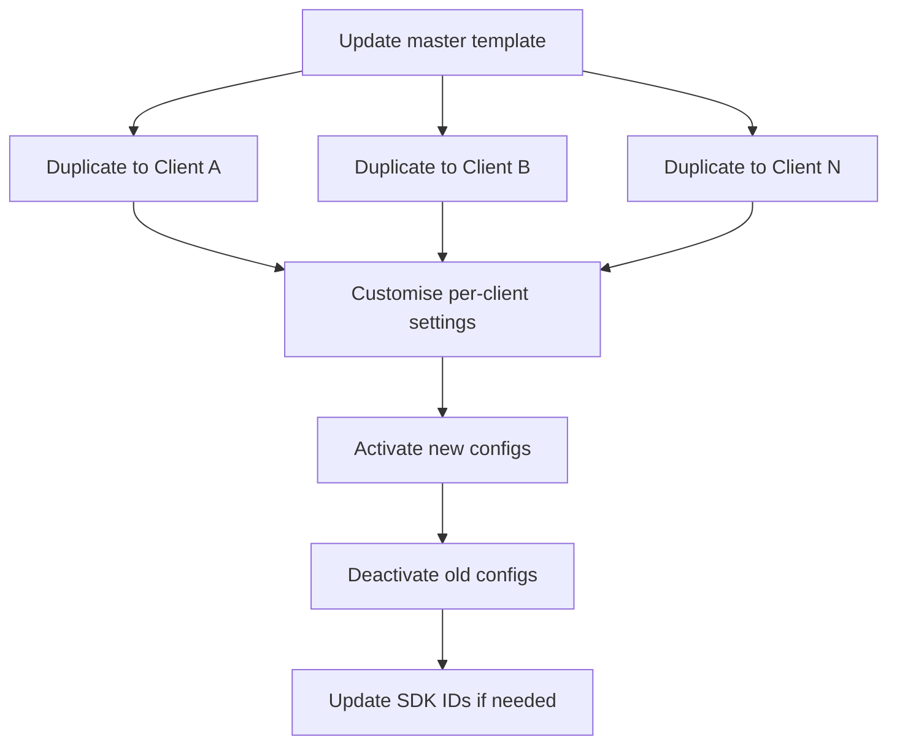

# Copying Configurations

Waulter's configuration duplication feature lets you create copies of existing configurations — enabling a powerful template-based workflow for managing consent across multiple websites.

## How to duplicate a configuration

1. Navigate to the configuration you want to copy in the dashboard.
2. Click the **Duplicate** or **Copy** action.
3. Enter a name for the new configuration.
4. The new configuration is created with all settings from the original.
5. Adjust domain-specific settings:
    - Update the **website URL** to the new domain
    - Update **whitelisted domains**
    - Review and adjust any domain-specific texts or settings
6. Activate the new configuration when ready.

### What is copied

| Copied | Not copied |
|--------|-----------|
| All purpose categories and their settings | Statistics and consent records |
| Banner text and translations | Configuration ID (a new one is generated) |
| Styling (template, colours, fonts, icon) | Active state (new configs start inactive) |
| GCM mode settings | Whitelisted domains (must be set for new domain) |
| Consent durations | |
| Linked document references | |

!!! info "New Configuration ID"
    The duplicated configuration receives a **new, unique Configuration ID**. You must use this new ID when deploying the SDK on the target domain.

## The template pattern

For agencies and organisations managing multiple websites, the template pattern provides an efficient workflow:

### Create a master template

1. Create a configuration with your standard settings (purposes, styling, texts, GCM mode).
2. Name it clearly as a template — e.g. `[TEMPLATE] Standard EU Banner`.
3. Keep the template configuration **inactive** — it is a blueprint, not a live config.

### Duplicate for each client or domain

1. Duplicate the template.
2. Name the new configuration for the specific client or domain (e.g. `Client ABC — example.com`).
3. Customise domain-specific settings:
    - Website URL and whitelisted domains
    - Client-specific colours, fonts, and logo
    - Client-specific text adjustments
4. Activate when ready.

### Maintain templates over time

When standards change (e.g. new purposes, updated legal text):

1. Update the template configuration with the new settings.
2. Duplicate the updated template for each affected client.
3. Review per-client customisations.
4. Swap: activate the new copy, deactivate the old configuration.

## Batch update workflow

When you need to update settings across multiple deployments:

### Step-by-step

1. **Update the template** with the new settings (purposes, text, styling, etc.).
2. **Duplicate** the template for each client/domain that needs the update.
3. **Customise** per-client settings (domain, branding, any client-specific text).
4. **Test** each new configuration using the Preview button.
5. **Activate** the new configurations.
6. **Deactivate** the old configurations.
7. **Update SDK deployment** if the Configuration ID changed (not needed if using Scenario IDs — scenarios can be pointed to the new configuration).

!!! tip "Use Scenario IDs for zero-downtime updates"
    If your SDK uses a **Scenario ID** instead of a direct Configuration ID, you can update the scenario to point to the new configuration — no code change needed on the website.

## Agency workflow

Agencies managing 10, 50, or 100+ client websites benefit most from the template pattern:

| Phase | Action |
|-------|--------|
| **Onboarding** | Duplicate template → customise for client → deploy |
| **Routine update** | Update template → duplicate to affected clients → swap active configs |
| **Legal change** | Update template text → roll out to all clients → verify compliance |
| **New feature** | Add to template → selective rollout to clients |

See the [Agency Guide](../agency/index.md) for the complete agency management workflow.

## Best practices

- **Name templates clearly** — prefix with `[TEMPLATE]` so they stand out in the configuration list
- **Keep templates inactive** — templates are blueprints, not live configs
- **Document customisations** — track which settings differ per client so updates don't overwrite them
- **Test before activating** — always use the Preview button on new copies
- **Archive old configs** — deactivate rather than delete old configurations so you have a history
