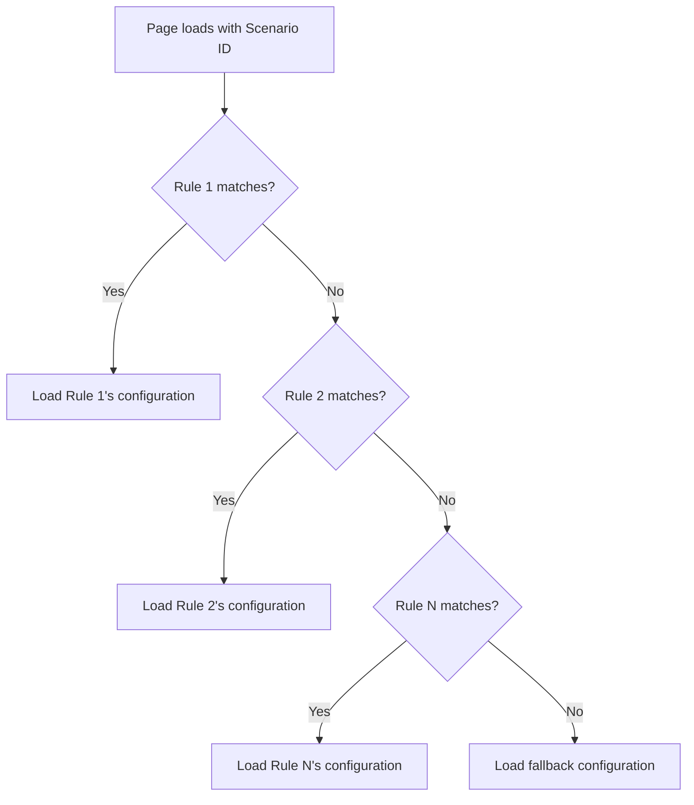

# Scenarios

Scenarios are **targeting rules** that dynamically determine which consent configuration is loaded for a given visitor context. They enable you to serve different consent experiences based on URL patterns, referrer domains, page views, user type, and any [custom field](../sdk/custom-fields.md) value.

## What is a scenario?

A scenario is a container for an ordered list of **rules**. Each rule defines:

1. **Conditions** — what must be true about the visitor's context
2. **Target configuration** — which consent configuration to load if the conditions match
3. **Force banner** — whether to show the banner even if the visitor already consented

Every scenario also has a **fallback configuration** that loads when no rules match.

## When to use scenarios

| Use case | Example |
|----------|---------|
| **Page-specific consent** | Show a lightweight banner on blog pages, a full banner on checkout |
| **A/B testing banners** | Split visitors between two banner designs |
| **User-type targeting** | Premium users see a branded banner; anonymous users see the default |
| **Campaign-specific flows** | Landing pages from an ad campaign use a special consent configuration |
| **Re-consent prompts** | Force the banner when purposes or legal text has changed |
| **Regional variations** | Different consent options per market or language |

## Evaluation flow

Rules are evaluated **in order, top to bottom**. The **first matching rule** determines which configuration loads. If no rule matches, the **fallback configuration** is used.



!!! warning "Order matters"
    Place more specific rules above more general ones. A broad rule placed first will match before a specific rule below it ever gets evaluated.

## Rule targeting variables

Rules evaluate against a context built from the visitor's current session:

| Variable | Type | Description | Example value |
|----------|------|-------------|---------------|
| `url` | string | Current page URL | `https://example.com/pricing` |
| `referer` | string | HTTP Referer header | `https://google.com/search?q=...` |
| `pageview` | number | Page views in current session | `3` |
| `acceptance` | string | Current consent state | `"allow"`, `"mixed"`, `"reject"`, `"empty"` |
| `purposes` | array | Currently accepted purpose codes | `["PU046", "PU050"]` |
| `customField1`–`customField10` | string | Custom field values from WaulterConfig | `"premium"`, `"campaign-summer"` |

## Supported operators

### Comparison operators

| Operator | Description | Example |
|----------|-------------|---------|
| `equals` | Exact string match | `url equals "https://example.com/promo"` |
| `not-equals` | Not equal to | `acceptance not-equals "allow"` |
| `contains` | Substring match | `url contains "/campaign/"` |
| `not-contains` | Does not contain substring | `url not-contains "/admin"` |
| `startsWith` | String begins with | `url startsWith "https://shop."` |
| `endsWith` | String ends with | `url endsWith "/checkout"` |
| `regex` | Regular expression match | `url regex "^https://.*\\.example\\.com"` |
| `>` | Greater than (numeric) | `pageview > 3` |
| `<` | Less than (numeric) | `pageview < 10` |
| `mod` | Modulo (for A/B splits) | `pageview mod 2` (even/odd split) |
| `in` | Value in list | `customField1 in ["vip", "premium"]` |

### Logical operators

Conditions can be combined using logical groups:

| Operator | Description | Behaviour |
|----------|-------------|-----------|
| `all` | AND — all conditions must match | Rule matches only if every condition in the group is true |
| `any` | OR — at least one condition must match | Rule matches if any single condition is true |

Groups can be **nested** for complex logic:

```
all:
  - url contains "/shop"
  - any:
    - customField1 equals "vip"
    - pageview > 5
```

This means: URL contains "/shop" **AND** (user is VIP **OR** has more than 5 page views).

## Example scenarios

### Different banner per section

| Rule | Condition | Configuration |
|------|-----------|---------------|
| Rule 1 | `url contains "/shop"` | E-commerce banner (full purposes) |
| Rule 2 | `url contains "/blog"` | Blog banner (analytics only) |
| Fallback | — | Default banner |

### A/B test two banner designs

| Rule | Condition | Configuration |
|------|-----------|---------------|
| Rule 1 | `pageview mod 2` equals 0 | Banner variant A |
| Fallback | — | Banner variant B |

### Re-consent after purpose changes

| Rule | Condition | Configuration |
|------|-----------|---------------|
| Rule 1 | `acceptance not-equals "empty"` | Updated configuration with **forceStartCB** enabled |
| Fallback | — | Standard configuration for new visitors |

### User-type targeting with custom fields

| Rule | Condition | Configuration |
|------|-----------|---------------|
| Rule 1 | `customField1 equals "enterprise"` | Enterprise-branded banner |
| Rule 2 | `customField1 equals "premium"` | Premium banner |
| Fallback | — | Default free-tier banner |

## The forceStartCB flag

When **forceStartCB** is enabled on a matched rule, the consent banner is **always displayed** — even if the visitor has valid, unexpired consent.

Use this for:

- **Re-consent flows** — when you add new purposes or change legal text, force visitors to re-consent
- **Campaign prompts** — show a special consent prompt on campaign landing pages regardless of prior consent
- **Compliance updates** — ensure all visitors see updated consent options after a regulatory change

!!! warning "Use sparingly"
    Forcing the banner on every page load creates a poor visitor experience. Use forceStartCB only for genuine re-consent requirements, and combine it with targeting rules so it only fires when needed.

**How it behaves:**

1. The visitor's existing consent data is cleared for this page load.
2. The banner opens as if the visitor is new.
3. The visitor must make a new consent decision.
4. The new decision replaces the old one.

## Best practices

### Scenario ordering

1. Place **re-consent / forceStartCB** rules at the top — they override existing consent
2. Place **specific targeting** rules (campaign pages, user types) in the middle
3. Place **broad rules** (page sections) lower
4. Let the **fallback** handle your default / production configuration

### Debugging scenarios

To verify which rule is matching for a given visitor:

1. Open your site in an **incognito window**
2. Enable `debug: true` in WaulterConfig:
   ```javascript
   window.WaulterConfig = {
     id: "SC00009",
     useGtm: true,
     debug: true
   };
   ```
3. Open the browser console and look for Waulter debug output showing which rule matched

### Keeping scenarios maintainable

- Give rules clear, descriptive names (e.g. "Premium users — branded banner")
- Document the purpose of each scenario in your team's runbook
- Review scenario order after adding new rules — a new rule in the wrong position can override existing ones
- Test changes in GTM Preview mode before publishing
