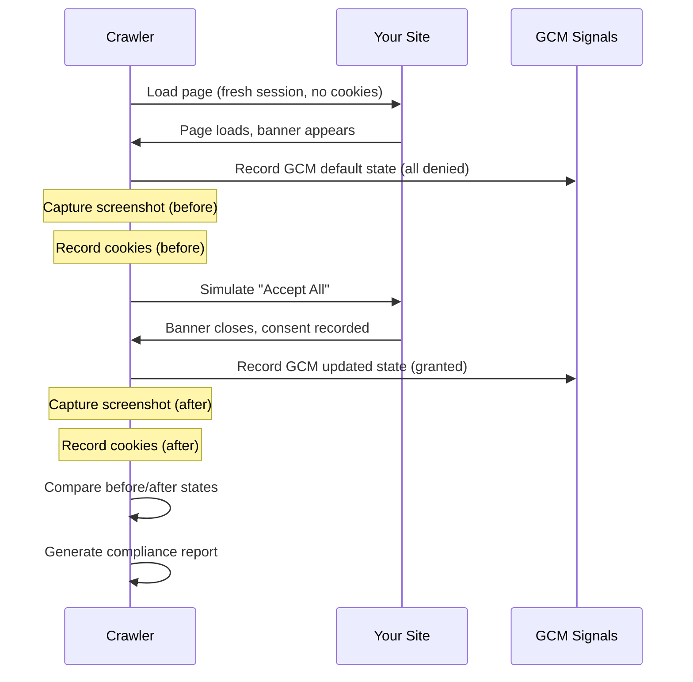

# Automated Compliance Monitoring

Waulter doesn't just deploy a consent banner — it continuously **monitors your website** to verify that your consent implementation is actually working correctly. Think of it as having an automated QA engineer watching over your shoulder, running compliance checks on a regular schedule.

## What Waulter monitors

The automated monitoring system periodically crawls your website and checks:

### Cookie detection
- Which cookies are set **before** the visitor interacts with the banner
- Which cookies are set **after** consent is given
- Whether any cookies are firing without proper consent (compliance risk)
- New cookies that appeared since the last scan (third-party scripts, analytics, marketing pixels)

### Google Consent Mode validation
- Whether GCM default consent signals are correctly set to `denied` on page load
- Whether consent signals update to `granted` after the visitor accepts
- Which GCM consent types are active (`analytics_storage`, `ad_storage`, `ad_personalization`, etc.)
- Risk assessment: low, medium, or high — based on how well your GCM implementation matches your purpose configuration

### Banner detection
- Whether the consent banner is present and visible
- Banner element details (position, type)
- Whether the banner includes all required interaction options (Accept, Reject, Customise)

### Screenshot capture
- **Before interaction** — what the visitor sees on page load (banner state)
- **Full page** — the complete page with banner overlay
- Screenshots are stored and available in the [Dashboard](../dashboard/cookie-detection.md) for visual verification

### Third-party script detection
- Google Tag Manager presence and configuration
- Analytics scripts (Google Analytics, Hotjar, etc.)
- Marketing pixels and retargeting scripts
- CMP provider detection (verifying Waulter is the active CMP)

## The consent flow check

The monitoring system simulates a complete visitor journey:

## What the monitoring catches

| Issue | How it's detected | Risk level |
|-------|-------------------|-----------|
| Cookies firing before consent | Cookie count > 0 before banner interaction | **High** |
| GCM signals not set to denied by default | Default consent state check fails | **High** |
| GCM signals not updating after consent | Before/after comparison shows no change | **High** |
| Banner not appearing | Banner element not detected on page | **Medium** |
| New third-party cookies since last scan | Cookie diff shows new entries | **Medium** |
| Non-technical cookies without purpose mapping | Cookie detected but not assigned to a purpose | **Medium** |
| Missing Accept/Reject options | Banner interaction elements incomplete | **Low** |

## The master check — change detection

Every scan is compared against the previous scan, creating a **diff view** (similar to a git diff) that highlights what changed:

- **New cookies** — appeared since last scan (new integration? new tracking script?)
- **Removed cookies** — no longer present (removed integration? changed config?)
- **Changed GCM behaviour** — consent signals behaving differently
- **Changed banner** — banner appearance or behaviour modified

This is visible in the [Cookie Detection dashboard](../dashboard/cookie-detection.md#the-master-check-diff-view) and is especially valuable after deployments — you can immediately see if a code change affected your consent compliance.

## Regular monitoring schedule

Waulter runs automated checks on a regular schedule. Each scan:

1. Opens your website in a clean browser session (no cookies, no stored consent)
2. Records the initial state (cookies, GCM signals, banner presence)
3. Simulates visitor consent interaction
4. Records the post-consent state
5. Compares with the previous scan
6. Generates a compliance report
7. Flags any new issues in your [Dashboard](../dashboard/compliance.md)

## Business value

### For DPOs and compliance officers
- **Evidence of ongoing compliance** — not just a one-time audit, but continuous verification
- **Early warning system** — catch issues from developer changes before they become GDPR violations
- **Audit-ready reports** — screenshot evidence + consent flow validation on every scan

### For developers
- **Post-deployment verification** — did your last release break consent flow?
- **Third-party script monitoring** — did a marketing team add a pixel that fires without consent?
- **GCM signal debugging** — are your consent signals actually reaching Google tags?

### For agencies managing multiple clients
- **Scale compliance oversight** — monitor all client sites from one dashboard
- **Proactive client communication** — alert clients to issues before they notice
- **Evidence for client reporting** — show clients their compliance status with screenshots

!!! tip "Waulter is looking over your shoulder"
    Think of automated monitoring as a compliance safety net. You deploy the consent banner, but Waulter continuously verifies that it's working correctly — checking cookies, validating GCM signals, and capturing evidence. When something changes (a new script, a configuration update, a broken integration), you know about it before your visitors or regulators do.

## Accessibility monitoring

The monitoring also checks **accessibility compliance** of the consent UI:

- Banner elements have proper ARIA roles and labels
- Interactive elements (buttons, toggles) meet minimum touch target sizes
- Colour contrast ratios meet WCAG 2.1 AA standards
- Keyboard navigation is functional (tab order, focus management)
- Screen reader compatibility (ARIA-live regions for dynamic content)

Accessibility issues are flagged in the [compliance report](../dashboard/compliance.md) alongside cookie and GCM findings. See [Accessibility](../accessibility/index.md) for Waulter's full accessibility commitment.

## Viewing monitoring results

All monitoring results are available in the Waulter B2B dashboard:

- **[Cookie Detection](../dashboard/cookie-detection.md)** — detailed cookie inventory, before/after states, master check diff
- **[Compliance Reports](../dashboard/compliance.md)** — aggregated findings, risk levels, recommendations
- **[Statistics](../dashboard/statistics.md)** — consent rates and trends over time

## What to do when issues are found

1. **High risk** — cookies firing before consent or GCM not defaulting to denied: fix immediately. Review your tag firing triggers and ensure all non-essential tags are gated behind consent.
2. **Medium risk** — new unmapped cookies: identify the source, assign to a purpose category, or remove the script.
3. **Low risk** — minor banner improvements: schedule for next maintenance window.

See [DEV & Testing Workflow](../good-practices/dev-testing.md) for how to test fixes safely before deploying to production.
