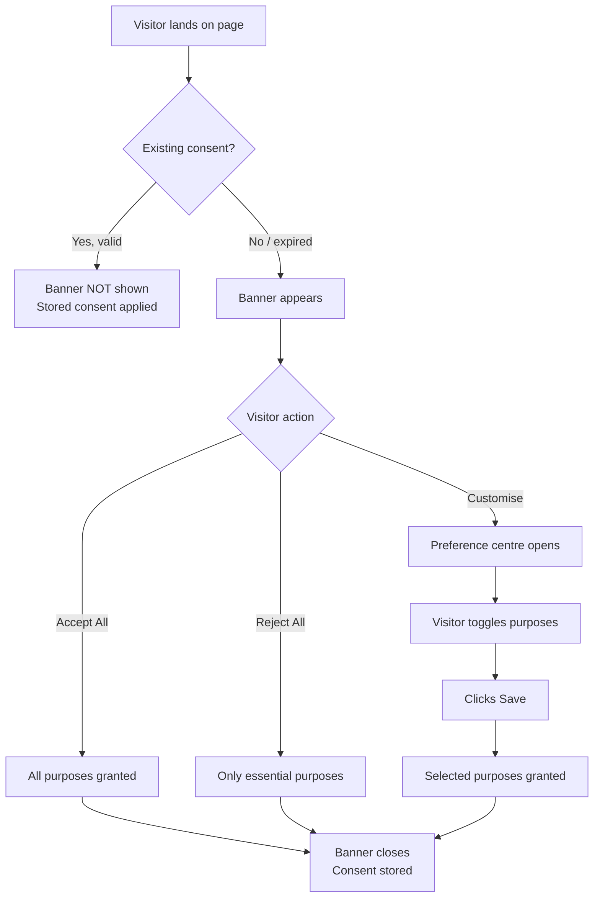

# Consent Banner

The consent banner is the primary interface visitors see when interacting with Waulter. It presents consent options clearly, collects the visitor's decision, and communicates that decision to Google Consent Mode and your tag management setup.

## Banner layers

The Waulter consent banner uses a **two-layer** design:

### First layer — the banner

The initial consent prompt that appears to visitors. It provides a clear summary and three action buttons:

| Element | Description |
|---------|-------------|
| **Title** | A brief heading (e.g. "We value your privacy") |
| **Description** | A short explanation of why consent is needed |
| **Accept All** button | Accepts all configured purposes |
| **Reject All** button | Rejects all non-essential purposes |
| **Customise** button | Opens the preference centre (second layer) |

The first layer is designed for visitors who want to make a quick decision. Most visitors interact only with this layer.

### Second layer — the preference centre

A detailed view showing each purpose category with a toggle switch. Visitors can:

- Read descriptions of each purpose category
- See which cookies belong to each category
- Enable or disable individual categories
- View links to the Cookie Policy and Privacy Policy
- Save their customised preferences

The preference centre opens when the visitor clicks **Customise** on the first layer.

## Banner positions

The banner can appear in different positions depending on the template:

| Position | Description | Best for |
|----------|-------------|----------|
| **Bottom bar** | A bar across the bottom of the page | Non-intrusive; allows visitors to continue browsing |
| **Modal / overlay** | A centred modal with background overlay | Maximum visibility; visitor must interact before continuing |
| **Corner** | A compact popup in a corner of the screen | Minimal visual disruption |

Banner position is determined by the [template](../dashboard/styling.md) configured in the dashboard.

## Visitor interaction flow



## Consent decisions

| Decision | What happens | `Waulter:Decision` event |
|----------|-------------|-------------------------|
| **Accept All** | All configured purposes are granted | `decision: "allow"`, `purposes: [all codes]` |
| **Reject All** | Only essential/technical purposes remain | `decision: "reject"`, `purposes: []` |
| **Customise + Save** | Only selected purposes are granted | `decision: "mixed"`, `purposes: [selected codes]` |

## Consent duration

Each consent decision type has a configurable validity period (default: 90 days):

| Setting | Default | Description |
|---------|---------|-------------|
| `defaultAllowDuration` | 90 days | How long "Accept All" consent remains valid |
| `defaultMixedDuration` | 90 days | How long "Customise" consent remains valid |
| `defaultRejectDuration` | 90 days | How long "Reject All" consent remains valid |

After the validity period expires, the banner appears again and the visitor must make a new decision.

## Re-opening the banner

Visitors must be able to change their consent at any time (GDPR requirement). Provide a visible link or button on every page:

```html
<a href="#" onclick="window.WaulterSDK.openWidget(); return false;">
  Manage Cookie Preferences
</a>
```

Common placements:

- Website footer
- Privacy/legal page
- Settings or account page
- A floating cookie icon (some templates include this automatically)

## Multilanguage behaviour

The banner displays text in the visitor's language when multilanguage is configured:

1. If `lang` is set in WaulterConfig → that language is always used
2. Otherwise → the SDK detects the browser language and selects the closest match
3. If no match → the configuration's primary language is used

See [Texts & Translations](../dashboard/texts.md) for setup instructions.

## Banner appearance configuration

All visual aspects of the banner are configured in the dashboard — not in code:

| Setting | Where to configure | Guide |
|---------|-------------------|-------|
| Template (layout) | Dashboard > Styling | [Styling & Templates](../dashboard/styling.md) |
| Colours | Dashboard > Styling > Custom Colours | [Styling & Templates](../dashboard/styling.md) |
| Fonts | Dashboard > Styling > Font | [Styling & Templates](../dashboard/styling.md) |
| Icon / logo | Dashboard > Styling > Icon | [Styling & Templates](../dashboard/styling.md) |
| All text | Dashboard > Texts | [Texts & Translations](../dashboard/texts.md) |
| Purposes shown | Dashboard > Purposes | [Purposes](purposes.md) |
| Legal document links | Dashboard > Documents | [Policy Documents](documents.md) |

## Banner suppression

The banner can be suppressed in specific situations:

| Method | Use case |
|--------|----------|
| Add `?no_waulter_cb` to URL | Cookie policy pages, admin pages, print views |
| Valid stored consent | Returning visitors within the consent validity period |
| SDK not deployed | Pages without the Waulter SDK tag |

## Accessibility

The consent banner is built with accessibility in mind:

- **Keyboard navigation** — all interactive elements are reachable via Tab and operable via Enter/Space
- **Screen reader support** — ARIA labels and roles for all banner components
- **Focus management** — focus is trapped within the banner while it is open
- **Contrast ratios** — default templates meet WCAG AA contrast requirements

See [Accessibility](../accessibility/index.md) for detailed WCAG compliance information.
