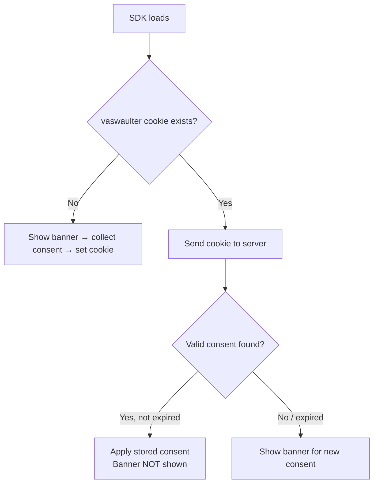

# Waulter Cookies

The Waulter SDK uses a first-party cookie to store the visitor's consent identifier. This page documents exactly what is stored, where, and why.

## Cookie reference

| Name | Type | Purpose | Expiry | Essential? |
|------|------|---------|--------|-----------|
| `vaswaulter` | First-party cookie | Stores the visitor's consent identifier, used to retrieve stored consent state on return visits | 365 days | Yes |

!!! info "No third-party cookies"
    The Waulter SDK does **not** set any third-party cookies. All storage is first-party, scoped to the domain where Waulter is deployed.

## How consent persistence works

### First visit

1. The SDK loads and checks for a `vaswaulter` cookie.
2. No cookie is found → the banner is displayed.
3. The visitor makes a consent decision.
4. The SDK stores the decision server-side and sets the `vaswaulter` cookie (365-day lifetime).
5. The cookie contains an identifier that links to the server-side consent record.

### Return visit

1. The SDK loads and finds the `vaswaulter` cookie.
2. The SDK sends the cookie value to the server during initialisation.
3. The server looks up the associated consent record.
4. If the consent is **valid** (not expired):
    - The stored decision is applied (GCM signals updated).
    - The banner is **not shown**.
5. If the consent is **expired**:
    - The banner is shown for a new decision.
    - The old record is replaced.

## Consent decision storage

The consent decision itself (allow, mixed, reject, which purposes) is stored **server-side**, not in the cookie. The cookie only contains an identifier that links to the server record.

| Stored where | What | Purpose |
|-------------|------|---------|
| `vaswaulter` cookie | Visitor consent identifier | Links the browser to the server-side record |
| Server | Decision, purposes, timestamp, expiry | Full consent record for retrieval and audit |

This design means:

- The cookie is small (just an identifier)
- Consent records are secure and tamper-proof (server-side)
- Consent can be validated and expired reliably

## Consent validity period

The consent decision expires after a configurable number of days:

| Decision | Default duration | WaulterConfig property |
|----------|-----------------|----------------------|
| Accept All | 90 days | `defaultAllowDuration` |
| Mixed | 90 days | `defaultMixedDuration` |
| Reject All | 90 days | `defaultRejectDuration` |

!!! tip "Cookie expiry vs consent expiry"
    The `vaswaulter` cookie has a 365-day expiry (browser persistence), but the consent decision has its own validity period (default 90 days). The cookie persists so the SDK can check consent status — even if the consent itself has expired, the cookie identifies the returning visitor.

## What happens when cookies are cleared

| Scenario | Result |
|----------|--------|
| Visitor clears all cookies | `vaswaulter` is deleted → SDK treats them as a new visitor → banner appears |
| Visitor clears only `vaswaulter` | Same as above — consent link is lost |
| Visitor clears cookies but not localStorage | SDK may not recover consent from localStorage alone — banner appears |
| Visitor uses incognito mode | No persistent cookies — banner appears on every session |

## Consent persistence across subdomains

When multiple subdomains are configured under the same Waulter account, the consent identifier in `vaswaulter` is linked to the same server-side record. This means a visitor who consents on one subdomain does not see the banner again on another:

1. Visitor consents on `www.example.com` → `vaswaulter` cookie set on `www.example.com`
2. Visitor navigates to `shop.example.com` → SDK loads and checks for consent
3. The server recognises the visitor via the consent identifier and returns the existing consent state
4. Banner is suppressed on `shop.example.com`

Each subdomain has its own `vaswaulter` cookie (first-party cookies are domain-scoped), but they reference the same server-side consent record. This works automatically when all subdomains use configurations under the same Waulter partner account.

!!! info "This is not the same as User Sharing"
    Subdomain consent persistence is automatic and visitor-facing. [User Sharing](user-sharing.md) is a separate B2B feature that controls which team members and agencies can access configurations in the dashboard. See [User Sharing](user-sharing.md) for details.

## Privacy and compliance

The `vaswaulter` cookie is classified as **strictly necessary** for CMP functionality:

- It does not track user behaviour
- It does not contain personal data (only an opaque identifier)
- It is required for the consent mechanism to function
- It does not require consent itself (essential cookie exception under ePrivacy Directive)

**Include it in your Cookie Policy** — even essential cookies should be disclosed to visitors. Document it as:

| Name | Provider | Purpose | Type | Expiry |
|------|----------|---------|------|--------|
| `vaswaulter` | Waulter (first-party) | Stores consent identifier for the cookie consent mechanism | HTTP Cookie | 365 days |

## Browser privacy features

Modern browsers include privacy features that may affect cookie persistence:

| Browser | Feature | Impact on `vaswaulter` |
|---------|---------|----------------------|
| Safari | Intelligent Tracking Prevention (ITP) | May cap first-party cookie lifetime to 7 days for JavaScript-set cookies |
| Firefox | Enhanced Tracking Protection (ETP) | Generally does not affect first-party essential cookies |
| Chrome | Third-party cookie phase-out | No impact — `vaswaulter` is first-party |
| Brave | Aggressive cookie blocking | May affect cookie persistence depending on settings |

!!! info "Safari ITP considerations"
    Safari's ITP may reduce the `vaswaulter` cookie lifetime on some configurations. Visitors on Safari may see the consent banner more frequently than the configured duration. This is a browser-level limitation affecting all CMPs.
