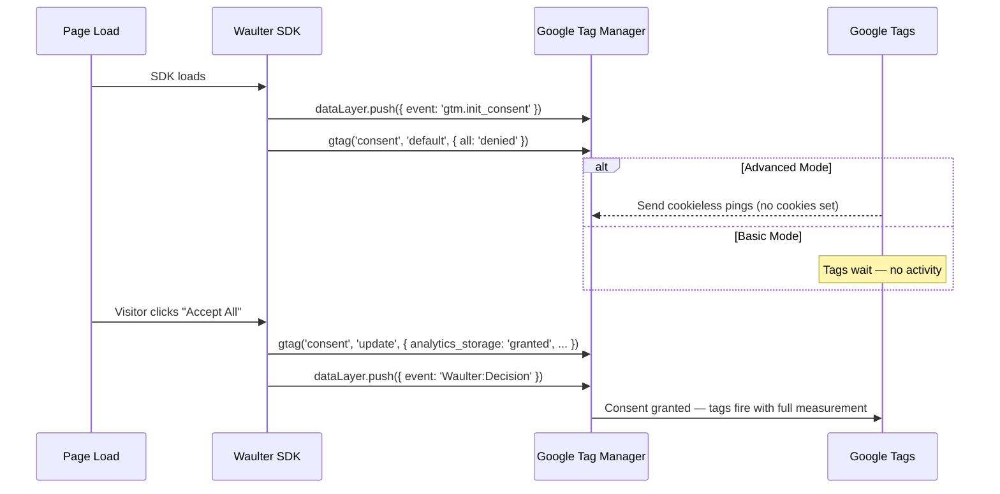

# Google Consent Mode 2.0

Google Consent Mode v2 (GCM v2) became mandatory for all Google Ads advertisers targeting EU traffic from **March 2024**. Waulter supports both Basic and Advanced modes out of the box — the SDK handles all consent signalling automatically.

## What is Google Consent Mode?

Google Consent Mode is an API that lets you communicate your visitors' consent state to Google tags (Analytics, Ads, Floodlight). Instead of blocking or loading tags based on consent, you signal the consent state and let Google adjust tag behaviour accordingly.

**Key benefit:** You maintain a single set of tags on the page. Google tags respond to consent signals without you having to add or remove tags.

## The 7 consent types

GCM v2 defines seven consent signals:

| Consent Type | Controls | Required for |
|-------------|----------|-------------|
| `analytics_storage` | Google Analytics cookies | GA4, Universal Analytics |
| `ad_storage` | Google Ads cookies | Google Ads, Campaign Manager |
| `ad_user_data` | Sending user data to Google for advertising | Google Ads conversions |
| `ad_personalization` | Personalised advertising and remarketing | Remarketing, similar audiences |
| `functionality_storage` | Functional cookies (language, region) | Optional |
| `personalization_storage` | Personalisation cookies | Optional |
| `security_storage` | Security cookies (authentication, fraud prevention) | Always granted |

!!! info "New in v2"
    `ad_user_data` and `ad_personalization` are new in GCM v2. They are required for Google Ads conversion tracking and remarketing in the EU.

## Basic Mode vs Advanced Mode

| | Basic Mode | Advanced Mode |
|--|-----------|---------------|
| **Before consent** | No Google tags fire. No data is collected. | Google tags send aggregated, cookieless pings. No cookies are set. |
| **After consent** | Tags fire normally with full measurement. | Tags fire normally with full measurement. |
| **Conversion modelling** | Not available (no pre-consent data) | Google uses pre-consent pings for conversion modelling and audience estimation |
| **Data collection before consent** | None | Aggregated signals only — no user-level data, no cookies |
| **Best for** | Maximum privacy; compliance-first approach | Better analytics coverage while still respecting consent |

### How Advanced Mode works

In Advanced Mode, Google tags operate in a **privacy-preserving state** before the visitor consents:

1. Tags load but do **not** set cookies
2. Tags send **cookieless pings** — aggregated signals without user identifiers
3. Google uses these signals for **conversion modelling** (estimating conversions from unconsented visitors) and **audience estimation**
4. Once the visitor consents, tags switch to full measurement mode

!!! tip "Advanced Mode is recommended"
    Google recommends Advanced Mode for better analytics accuracy. The cookieless pings contain no personal data and are fully compliant with GDPR when used with a CMP like Waulter.

## Waulter's automatic GCM integration

When you deploy Waulter with `useGtm: true`, the SDK handles all GCM signalling automatically. You do **not** need to write any consent mode code yourself.

### What happens automatically



**Step by step:**

1. **SDK starts** — pushes `gtm.init_consent` and sets all signals to `denied`
2. **Banner appears** — visitor sees consent options
3. **Visitor decides** — SDK maps accepted [purposes](purposes.md) to GCM signals and pushes a `consent update`
4. **Tags respond** — Google tags that were waiting for consent now fire

### Default consent state

On every page load, the SDK sets all signals to `denied`:

```javascript
gtag('consent', 'default', {
  ad_personalization: 'denied',
  ad_storage: 'denied',
  ad_user_data: 'denied',
  analytics_storage: 'denied',
  functionality_storage: 'denied',
  personalization_storage: 'denied',
  security_storage: 'denied'
});
```

This ensures no Google tags collect data before the visitor has consented.

### Consent update after decision

After the visitor decides, the SDK builds a consent update from the accepted purposes:

```javascript
// Example: visitor accepted analytics + advertising purposes
gtag('consent', 'update', {
  ad_personalization: 'granted',
  ad_storage: 'granted',
  ad_user_data: 'granted',
  analytics_storage: 'granted',
  functionality_storage: 'denied',
  personalization_storage: 'denied',
  security_storage: 'granted'
});
```

See [Purposes — Purpose-to-GCM signal mapping](purposes.md#purpose-to-gcm-signal-mapping) for which purposes map to which signals.

## Configuring GCM mode

### In the Waulter dashboard

1. Open your website configuration in the dashboard.
2. Navigate to the **Google Consent Mode** section.
3. Choose **Basic** or **Advanced** mode.
4. Save the configuration.

The mode is stored on the configuration (not in the SDK). This means you can switch modes without changing any code on your site.

### In the GTM template

If you use the [Community Template](../implementation/gtm/community-template.md), select the GCM Mode in the template fields:

| Field | Options |
|-------|---------|
| GCM Mode | Basic / Advanced |

### Checking the mode programmatically

```javascript
// Check if GCM v2 is enabled
if (window.WaulterSDK.getEnableGCM2()) {
  console.log('GCM v2 is active');
}

// Check if Advanced Mode is enabled
if (window.WaulterSDK.getEnableGCM2Advanced()) {
  console.log('Advanced Mode — cookieless pings enabled');
}
```

## Testing GCM integration

### Using GTM Preview + Tag Assistant

1. In GTM, click **Preview** and enter your site URL.
2. The Tag Assistant panel opens alongside your site.
3. Check the **Consent** tab in Tag Assistant:

| What to verify | Expected result |
|---------------|----------------|
| Default consent state | All signals show `denied` |
| After "Accept All" | Relevant signals change to `granted` |
| After "Reject All" | All signals remain `denied` |
| After "Mixed" selection | Only relevant signals change to `granted` |
| `gtm.init_consent` event | Fires first, before any other events |

### Using browser Developer Tools

1. Open the **Console** tab.
2. Enable `debug: true` in your WaulterConfig.
3. Look for consent-related log entries showing default and update calls.
4. Check the **Network** tab for Google tag requests — in Basic Mode, no requests should appear before consent.

### Common testing scenarios

| Test | Steps | Expected |
|------|-------|----------|
| New visitor | Open site in incognito | Banner appears, default consent is all `denied` |
| Accept all | Click "Accept All" | All signals become `granted`, analytics/ad tags fire |
| Reject all | Click "Reject All" | All signals remain `denied`, no tags fire |
| Mixed consent | Open preferences, select only analytics | `analytics_storage: granted`, ad signals remain `denied` |
| Returning visitor | Accept, close, reopen site | Banner not shown, stored consent signals applied on load |

!!! tip "Clear consent for testing"
    Delete the `vaswaulter` cookie and reload the page to test as a new visitor. In Chrome: Developer Tools > Application > Cookies > select and delete `vaswaulter`.
