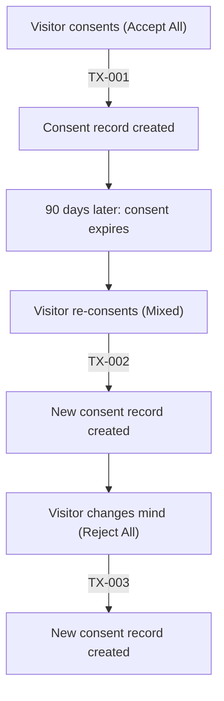

# Permission Transaction ID

Every consent interaction in Waulter generates a unique **Permission Transaction ID** — a tamper-evident identifier that serves as proof-of-consent for GDPR accountability purposes.

## What is the Permission Transaction ID?

The Permission Transaction ID is a unique identifier generated each time a visitor makes a consent decision (accept, reject, or mixed). It links a specific visitor's consent choice to a precise point in time, creating an immutable consent receipt.

| Property | Description |
|----------|-------------|
| **Unique** | Every consent interaction generates a new ID |
| **Immutable** | The record cannot be altered after creation |
| **Timestamped** | Records the exact moment the decision was made |
| **Linked** | Connects the decision to the specific configuration and purposes |

## What a consent receipt contains

Each Permission Transaction ID is linked to a consent receipt that records:

| Field | Description |
|-------|-------------|
| **Transaction ID** | The unique identifier for this consent interaction |
| **Timestamp** | When the consent decision was made |
| **Decision** | `allow`, `mixed`, or `reject` |
| **Purposes granted** | List of purpose codes the visitor accepted |
| **Purposes denied** | List of purpose codes the visitor rejected |
| **Configuration ID** | Which configuration was active when consent was given |
| **Page URL** | The page where consent was collected |
| **Validity period** | When the consent expires (`notAfter` timestamp) |

## Where to find it

### In the dashboard

1. Navigate to your configuration in the Waulter dashboard.
2. Open the **Consent Records** or **Transaction Log** section.
3. Each entry shows the Permission Transaction ID, timestamp, decision, and purposes.

### In the consent response

When a consent decision is saved, the response includes the Permission Transaction ID:

```json
{
  "decision": "allow",
  "notAfter": 1750000000,
  "permissionTransaction": "acceptance-id-123"
}
```

The `permissionTransaction` field contains the ID of the created consent receipt.

## GDPR accountability

### Article 7(1) compliance

GDPR Article 7(1) states:

> *"Where processing is based on consent, the controller shall be able to demonstrate that the data subject has consented to the processing of his or her personal data."*

The Permission Transaction ID provides this demonstration. For any visitor, you can retrieve the consent receipt showing:

- **When** they consented
- **What** they consented to (specific purposes)
- **How** the consent was collected (which configuration/banner)

### Proof of consent

Each consent receipt is:

- **Immutable** — once created, the record cannot be modified
- **Auditable** — records are retained and can be retrieved for compliance audits
- **Specific** — ties consent to exact purposes, not just a generic "consent given" flag
- **Time-bound** — records when consent was given and when it expires

## How DPOs use Permission Transaction IDs

| Use case | How |
|----------|-----|
| **Compliance audits** | Provide auditors with consent receipts for any time period, showing consent was properly collected |
| **Data Subject Access Requests (DSARs)** | When a visitor requests their data, include their consent records with Transaction IDs |
| **Proving consent before processing** | Demonstrate that consent was collected before data processing began, with timestamps |
| **Verifying scope of consent** | Show exactly which purposes were granted — important when processing is challenged |
| **Consent withdrawal tracking** | When a visitor withdraws consent, a new Transaction ID is generated, creating a clear audit trail |

## Consent lifecycle and Transaction IDs

Each action in the consent lifecycle generates a new Permission Transaction ID:



Each Transaction ID is independent — the full history of a visitor's consent decisions is preserved as a chain of immutable records.

## Retention

Consent receipts are retained for the duration required by your regulatory obligations:

- GDPR does not specify a mandatory retention period for consent records
- Best practice: retain consent receipts for at least as long as the data processing activities they authorise
- Some interpretations suggest retaining for the duration of any applicable statute of limitations (typically 3-6 years)

!!! tip "Consult your DPO"
    Work with your Data Protection Officer to determine the appropriate retention period for consent receipts based on your organisation's processing activities and applicable regulations.
