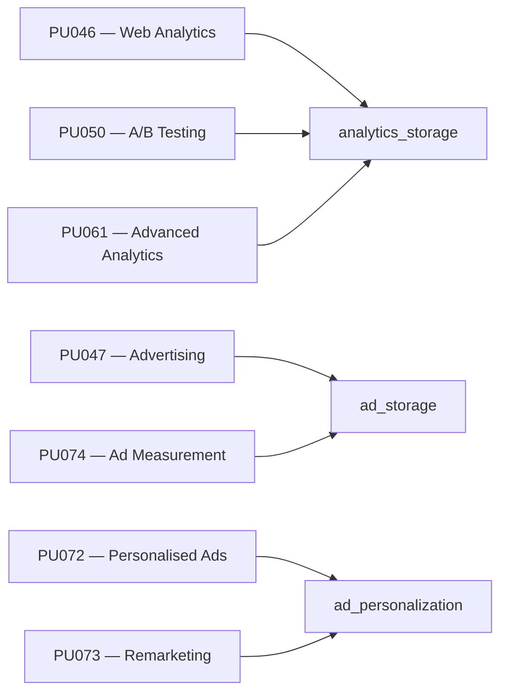

# Purposes

Purposes are the individual **data-processing activities** for which Waulter collects user consent. Each purpose represents a category of cookies or tracking technologies on your site. Visitors see purposes in the consent banner and preference centre, where they can accept or reject each one.

## How purposes work

1. You configure purposes in the Waulter dashboard for your website configuration.
2. The SDK presents them to visitors in the consent banner.
3. The visitor accepts all, rejects all, or selects specific purposes.
4. The SDK maps accepted purposes to **Google Consent Mode signals** and updates them automatically.
5. The accepted purpose codes are included in the `Waulter:Decision` [data layer event](events.md).

## Standard purpose codes

Waulter provides a set of standard purpose codes that cover common cookie categories:

| Code | Name | Description | GCM Signal |
|------|------|-------------|-----------|
| — | Essential / Technical | Security cookies, session management, load balancing | `security_storage` (always granted) |
| PU046 | Web Analytics (Basic) | Traffic analysis, page views, basic visitor statistics | `analytics_storage` |
| PU047 | Advertising / Marketing | Ad delivery, campaign measurement cookies | `ad_storage` |
| PU050 | A/B Testing & Analysis | Experiment assignment, variant tracking | `analytics_storage` |
| PU061 | Advanced Analytics | Heatmaps, session recordings, funnel analysis | `analytics_storage` |
| PU072 | Personalised Advertising | Interest-based ad selection, personalisation | `ad_personalization` |
| PU073 | Remarketing | Cross-site ad retargeting | `ad_personalization` |
| PU074 | Ad Network Measurement | Conversion tracking, ad attribution | `ad_storage` |

!!! info "Technical purposes are always granted"
    Essential / technical purposes cannot be toggled by visitors. They are always granted because they are necessary for the website to function.

## Purpose-to-GCM signal mapping

Each purpose maps to one or more **Google Consent Mode v2** signals. When a visitor accepts a purpose, the SDK sets the corresponding signal to `granted`.



### Purposes are per-configuration

Purposes are **specific to each configuration** — every configuration has its own set of enabled purposes. This means two configurations can offer completely different purpose sets to visitors.

!!! tip "Duplicate configurations to save time"
    Setting up purposes from scratch for every new configuration is tedious. Use the [Duplicate Configuration](../dashboard/copy-config.md) feature to copy an existing configuration — all purpose selections, texts, and mappings are carried over. Then adjust only what's different.

!!! warning "Deleting purposes when cookies are mapped"
    Once a configuration has **cookies mapped to purposes**, those purposes become mandatory — they cannot be deleted while cookies reference them. If you need to remove a purpose:

    1. First **unmap or delete the cookies** that are assigned to that purpose
    2. Then delete the purpose from the configuration

    This safeguard prevents orphaned cookies that would fire without proper consent coverage.

### Signal aggregation rule

A GCM signal is set to `granted` if **any** accepted purpose maps to it. This is an OR-based aggregation — a single accepted purpose is enough to flip the corresponding signal.

**Example:** If a visitor accepts only PU046 (Web Analytics), `analytics_storage` becomes `granted` — even though PU050 (A/B Testing) and PU061 (Extended Analytics) were rejected. This means any tag gated behind `analytics_storage` will fire, including those you might associate with the rejected purposes.

!!! warning "Your responsibility: honour the visitor's intent"
    The signal aggregation is a **technical mechanism** — it tells Google tags whether a storage type is allowed. But the **ethical and legal responsibility** for how you use that signal remains with you.

    If a visitor explicitly rejected A/B testing (PU050) but accepted basic analytics (PU046), `analytics_storage` is `granted`. Technically, you *could* run A/B testing scripts under that signal. But doing so would:

    - **Violate the visitor's expressed choice** — they said no to A/B testing
    - **Risk non-compliance** with GDPR Article 7 (conditions for consent) — consent must be specific and informed
    - **Erode user trust** — if visitors discover their explicit rejections are being bypassed

    **Best practice:** Configure your tags to respect the individual purpose level, not just the GCM signal. Use the `Waulter:Decision` event's `purposes` array to check which specific purposes were accepted before firing granular tags. See [Events & Data Layer](events.md) for how to build purpose-level GTM triggers.

### Complete mapping table

| GCM Signal | Granted when any of these purposes are accepted |
|-----------|------------------------------------------------|
| `analytics_storage` | PU046, PU050, PU061 |
| `ad_storage` | PU047, PU074 |
| `ad_personalization` | PU072, PU073 |
| `ad_user_data` | Depends on configuration (linked to ad-related purposes) |
| `functionality_storage` | Functionality purposes (if configured) |
| `personalization_storage` | Personalisation purposes (if configured) |
| `security_storage` | Always `granted` (essential) |

## Configuring purposes

Purposes are configured in the Waulter dashboard under your website configuration:

1. Navigate to your configuration in the dashboard.
2. Open the **Purposes** section.
3. Enable or disable the purpose categories your site uses.
4. For each purpose, review the description text that visitors will see.
5. Save and publish the configuration.

!!! tip "Only enable what you use"
    Only enable purposes that match actual cookies or tracking technologies on your site. Asking consent for purposes you don't use creates unnecessary friction and may raise compliance questions.

## Purposes and the consent decision

When the visitor makes a decision, the SDK sends the accepted purpose codes in the `Waulter:Decision` data layer event:

| Decision | `purposes` array |
|----------|-----------------|
| Accept all | All configured purpose codes (e.g. `["PU046", "PU047", "PU050", "PU061", "PU072", "PU073", "PU074"]`) |
| Mixed | Only the selected codes (e.g. `["PU046", "PU050"]`) |
| Reject all | Empty array `[]` |

You can use these purpose codes in GTM triggers to control which tags fire. See [Events & Data Layer — Building GTM triggers](events.md#building-gtm-triggers).

## Purposes in scenarios

When using [scenarios](../dashboard/scenarios.md), different configurations can have different purposes enabled. This allows you to:

- Show fewer purpose categories on simple pages (e.g. blog)
- Show the full set on pages with advertising (e.g. homepage, product pages)
- Add new purposes for specific campaigns

The `purposes` context variable in scenario rules refers to the visitor's **currently accepted** purpose codes, enabling rules like:

```
purposes not-contains "PU047"
```

This targets visitors who have not yet consented to advertising cookies.

## Purpose categories and the preference centre

In the preference centre, purposes are grouped into **categories** for a cleaner visitor experience. Categories are configured in the dashboard:

| Category | Typical purposes |
|----------|-----------------|
| Essential | Technical / security cookies (always on, cannot be toggled) |
| Analytics | PU046, PU050, PU061 |
| Marketing | PU047, PU072, PU073, PU074 |
| Personalisation | Personalisation purposes (if configured) |
| Preferences | Functionality purposes (if configured) |

Each category shows a toggle switch. Visitors can expand a category to see individual purposes with their descriptions and associated cookies.
