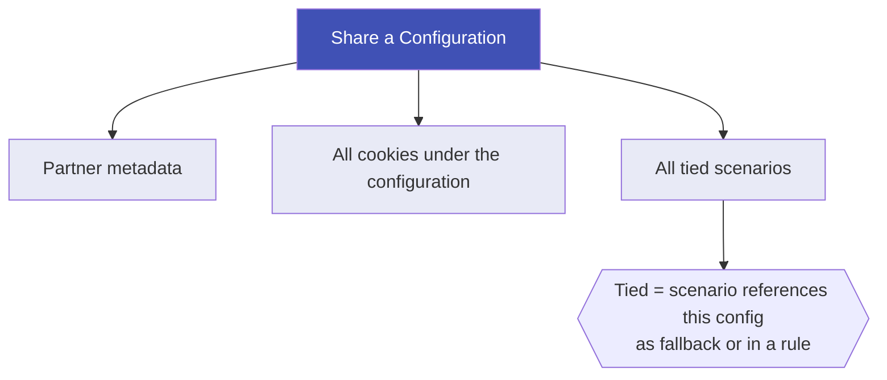

# User Sharing

User Sharing lets you control who can access your configurations, scenarios, and cookies in the Waulter dashboard. You can share with individual team members, agency clients, or entire organisations — without giving everyone access to everything.

There are two sharing modes: **local sharing** (share a single configuration) and **global sharing** (share all configurations under a partner).

!!! warning "Sharing is per-partner"
    Both sharing modes operate **within a single partner**. If you manage multiple partners (e.g. multiple client accounts as an agency), you must set up sharing separately for each partner. There is no "share across all partners at once" option in the dashboard.

    **Managing many partners?** If you need to set up sharing for a large number of partners in bulk, [contact the Waulter team](https://waulter.eu) — we can assist with batch sharing operations.

## Two sharing modes

### Local sharing (per-configuration)

Local sharing grants a specific user access to a **single configuration**. Use this when you want fine-grained control over who sees what.

**Use cases:**

- Share your DEV configuration with developers, but keep PROD restricted to ops — see [DEV & Testing Workflow](../good-practices/dev-testing.md)
- An agency shares a specific client configuration with that client's marketing manager
- Grant a colleague access to one site without exposing your entire portfolio

**How to share locally:**

1. Open the configuration in the Waulter dashboard.
2. Navigate to the **Sharing** section.
3. Enter the target user's **email address**.
4. Select the **role** (`read` or `admin`).
5. Click **Share**.

The target user immediately sees the configuration in their dashboard.

!!! info "The target user must be registered"
    You can only share with users who have an existing Waulter account. If they don't have one yet, they need to register first.

### Global sharing (per-partner)

Global sharing grants a user access to **all configurations under a partner** — including any configurations created in the future. This is a persistent rule, not a one-time action.

**Use cases:**

- An agency shares everything with a client's account manager who needs visibility across all sites
- A company gives a new team member access to all configurations at once
- Waulter support staff need access to all configurations for troubleshooting

**How to set up global sharing:**

1. Open the **Partner** section in the dashboard.
2. Navigate to **Global Sharing**.
3. Enter the target user's **email address**.
4. Select the **role** (`read` or `admin`).
5. Click **Add Global Share**.

!!! warning "Only the partner owner can manage global sharing"
    Global sharing is managed at the partner level. Only the user who owns the partner entity can add or remove global shares. Having admin access to individual configurations is not sufficient.

### Comparison

| | Local sharing | Global sharing |
|--|--------------|---------------|
| **Scope** | One specific configuration | All configurations under a partner |
| **Future configurations** | Not included — must be shared manually | Automatically included |
| **Who can manage** | Configuration owner or any user with admin role | Partner owner only |
| **Removal** | Removes access to that one configuration | Can remove all access, or remove only the global rule while preserving any local shares |

## Roles

| Role | Access level |
|------|-------------|
| `read` | View the configuration, cookies, and scenarios — cannot modify anything |
| `admin` | Full control — edit, delete, manage sharing, re-share with others |

!!! tip "Effective role = highest role"
    If a user has both local and global access to a configuration, the **higher role wins**. For example, if a user has `read` globally but `admin` locally on one configuration, they get `admin` on that configuration and `read` on everything else.

## What gets shared (cascade)

When you share a configuration — locally or globally — permissions automatically cascade to related entities:

| Entity | What happens |
|--------|-------------|
| **Configuration** | The user is added to the configuration's access list |
| **Partner** | The user receives access to the partner metadata |
| **Cookies** | All cookies mapped to the configuration are shared |
| **Tied scenarios** | Scenarios that reference this configuration (as a fallback or in a rule) are shared |

!!! info "Cascade is one level deep"
    Scenario sharing does not chain further. If a tied scenario references configurations owned by other users, those configurations are **not** shared. This prevents unintended access across ownership boundaries.

### Global sharing cascade

When you add a global share, the cascade runs across **all active configurations** under the partner:

1. Every active configuration under the partner receives the user's permission
2. Each configuration's cookies and tied scenarios are also shared
3. Any **new configuration** created under this partner in the future is automatically shared with the user

## Self-removal

A user who has been given shared access can **remove themselves** from a configuration they don't own. This is useful when:

- A team member changes roles and no longer needs access
- A client wants to revoke their own access after a project ends
- Preparing for a [Transfer of Ownership](../agency/transfer.md)

Self-removal does not require admin permission — any shared user can remove themselves.

## Removing shared access

### Removing a local share

The configuration owner (or any user with admin role) can remove a user's local access:

1. Open the configuration's **Sharing** section.
2. Find the user in the access list.
3. Click **Remove**.

The user immediately loses access to the configuration and its cascaded entities (cookies, tied scenarios).

### Removing a global share

When removing a global share, you have two options:

| Option | Behaviour |
|--------|----------|
| **Preserve local shares** (default) | Removes the global rule and any globally-sourced access. If the user also has local shares on specific configurations, those are **kept**. |
| **Remove all access** | Removes the global rule **and** all access to all configurations under this partner — both global and local shares are revoked. |

## Audit trail

Every sharing operation creates an immutable event log entry. This provides a complete history of who shared what, with whom, and when.

**Logged events include:**

- Share (local and global)
- Unshare (local and global)
- Self-removal
- Role changes

**Each event records:**

- Who initiated the action
- The target user
- The role granted or revoked
- Which configurations and scenarios were affected
- Timestamp

!!! tip "GDPR accountability"
    The audit trail helps demonstrate compliance with GDPR accountability requirements. You can review the sharing history to verify that access to consent data has been properly managed.

## Best practices

| Practice | Why |
|----------|-----|
| Use **local sharing** for DEV/PROD separation | Developers get DEV access; only ops team gets PROD — see [DEV & Testing Workflow](../good-practices/dev-testing.md) |
| Use **global sharing** sparingly | It grants access to everything, including future configurations. Prefer local sharing for targeted access. |
| Review access lists periodically | Remove users who no longer need access. Shared users can also self-remove. |
| Use `read` role for view-only access | When someone only needs to review a configuration (e.g. for compliance auditing), grant `read` instead of `admin`. |

## Troubleshooting

| Issue | Cause | Solution |
|-------|-------|----------|
| User doesn't see the shared configuration | User is not registered | The user must create a Waulter account first |
| User doesn't see the shared configuration | Email mismatch | Verify the exact email address used for their Waulter account |
| Cannot add global sharing | Not the partner owner | Only the partner owner can manage global shares |
| Shared user cannot edit the configuration | Role is `read` | Update their role to `admin` if they need edit access |
| Removed global share but user still has access | User has a local share too | Remove the local share separately, or use the "Remove all access" option |
| Tied scenario not shared | Scenario not linked to the configuration | The scenario must reference the configuration as a fallback or in a rule |
