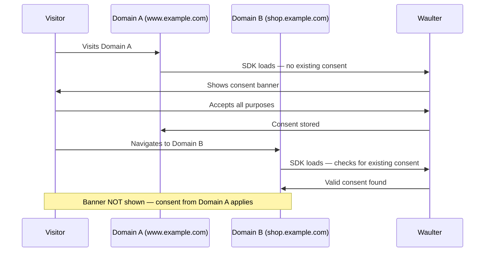

# User Sharing

User Sharing allows your visitors to **consent once** and have that decision honoured across your entire domain portfolio — without being shown the consent banner on every site.

## How it works

When User Sharing is enabled, Waulter links consent decisions to a persistent visitor identifier rather than a single domain. This means:

1. A visitor consents on **Domain A** (e.g. `www.example.com`).
2. The visitor navigates to **Domain B** (e.g. `shop.example.com`).
3. Waulter on Domain B detects the existing consent linked to the visitor's identifier.
4. If the consent is **valid and unexpired**, the banner is suppressed — the visitor's previous choices are applied automatically.
5. If the consent is **expired or not found**, a new consent collection begins.

## Setting up User Sharing

### Prerequisites

- All participating domains must have Waulter deployed with the SDK.
- All domains must belong to the **same Waulter account** (same partner).
- Domains must be listed in the configuration's **Whitelisted Domains**.

### Configuration

1. Log in to the Waulter dashboard.
2. Open your website configuration.
3. Enable the **User Sharing** option.
4. Add all participating domains to the **Whitelisted Domains** list.
5. Deploy the SDK on each domain with the same Configuration ID or Scenario ID.

!!! info "Same Configuration ID"
    For User Sharing to work, all participating domains should use the same Configuration ID (or Scenario IDs that resolve to configurations under the same partner). This ensures consent decisions are recognised across domains.

## What gets shared

| Shared | Not shared |
|--------|-----------|
| Consent decision (`allow`, `mixed`, `reject`) | Banner styling or text (each domain uses its own configuration) |
| Accepted purpose codes | Custom fields (set per-page) |
| Consent expiration date | Statistics (each domain tracks separately) |

## Privacy considerations

User Sharing is designed with privacy in mind:

- **No cross-site tracking** — the mechanism is strictly for consent portability, not visitor tracking.
- **GDPR-compliant** — consent decisions are scoped to the visitor's browser session and identifier. No personal data beyond the consent record is shared between domains.
- **Visitor control** — visitors can always withdraw consent on any domain. Revocation propagates: if a visitor revokes consent on Domain B, that decision is reflected when they return to Domain A.
- **Transparency** — the consent banner and preference centre display the same consent state across all domains. Visitors see consistent information about their choices.

!!! tip "Privacy policy disclosure"
    Mention in your Privacy Policy that consent is shared across your domains. List the participating domains so visitors know where their consent applies.

## Limitations

| Limitation | Details |
|-----------|---------|
| **Same Waulter account** | User Sharing only works between domains managed under the same Waulter partner account. It does not work across different accounts or organisations. |
| **SDK required on all domains** | Every participating domain must have the Waulter SDK deployed. If a domain does not have the SDK, consent cannot be checked or applied there. |
| **Browser privacy features** | Safari's Intelligent Tracking Prevention (ITP), Firefox's Enhanced Tracking Protection (ETP), and similar browser privacy features may affect the persistence of the consent identifier. Visitors using aggressive privacy settings may be prompted more frequently. |
| **Incognito / private browsing** | Consent stored in a private browsing session is not available in normal browsing mode (and vice versa). |
| **Consent expiration** | Shared consent respects the configured duration. If consent expires on one domain, it is expired on all domains. |

## User Sharing and statistics

When consent is shared across domains, each domain tracks its own statistics independently:

- **Domain A** records the original consent event (the visitor's first decision).
- **Domain B** records that a returning visitor loaded the page with existing consent.
- Consent rates in the dashboard reflect per-domain visitor interactions.

!!! info "Consent "belongs" to the domain where it was given"
    The original consent decision is attributed to the domain where the visitor first interacted with the banner. Subsequent domains benefit from the shared consent but do not count it as a new consent event.

## Troubleshooting

| Issue | Possible cause | Solution |
|-------|---------------|----------|
| Banner appears on Domain B despite consenting on Domain A | Domain B not whitelisted | Add Domain B to **Whitelisted Domains** in the dashboard |
| Banner appears on Domain B | Different Configuration ID | Ensure both domains use the same Configuration ID or partner |
| Consent not persisting | Browser privacy mode (ITP/ETP) | Inform users; consider a note about cookie settings |
| Consent not persisting | Incognito browsing | Expected behaviour — incognito sessions are isolated |
| Consent expired | Duration elapsed | The visitor must consent again; this is normal |
