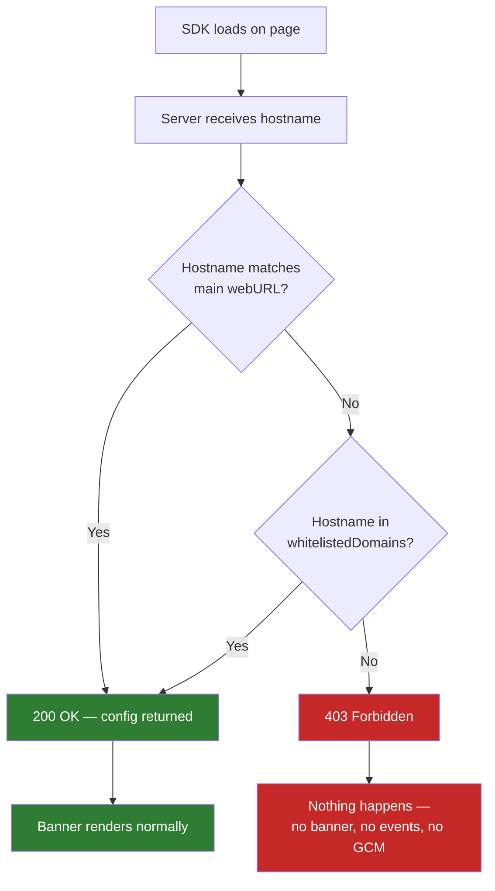

# Whitelisted Domains

Whitelisted Domains is a **security mechanism** that controls which domains are authorized to render the Waulter consent banner. If a domain is not whitelisted, the banner **will not appear** — the server returns HTTP 403 and nothing happens on the page.

!!! danger "This is a security check, not a statistics filter"
    If your domain is not whitelisted, the banner **does not render**. No consent is collected, no GCM signals are sent, and no events fire. The domain must be whitelisted for Waulter to work at all.

## How it works

When the SDK loads on a page, it calls the Waulter server with the current page's hostname. The server checks whether that hostname is authorized:

**The server checks two things:**

1. Does the hostname match the configuration's **main website URL** (`webURL`)?
2. Does the hostname appear in the configuration's **whitelisted domains** list?

If **neither** matches, the server returns **HTTP 403 Forbidden** with `error: "domain_not_whitelisted"`. The SDK receives no configuration, and the page behaves as if Waulter was never installed.

## Why this matters

### Security protection

Domain whitelisting prevents:

- **Configuration hijacking** — someone embedding your consent configuration on their domain
- **Unauthorized banner rendering** — the banner appearing on domains you don't control
- **Data pollution** — consent events from unauthorized sources appearing in your statistics

Without whitelisting, anyone could copy your SDK script tag and Configuration ID onto their site and render your consent banner, collecting consent under your configuration.

### The development challenge

This security mechanism creates a common friction point during development: **the banner won't appear on domains you haven't whitelisted**.

This affects:

| Environment | Example domain | Problem |
|------------|---------------|---------|
| **Local development** | `localhost`, `127.0.0.1` | Not whitelisted by default |
| **Staging servers** | `staging.example.com` | Not whitelisted unless added |
| **Webflow** | `project-abc.webflow.io` | Webflow's preview domain not whitelisted |
| **Vercel** | `project-abc.vercel.app` | Vercel's preview domain not whitelisted |
| **Netlify** | `deploy-preview-123--site.netlify.app` | Netlify preview URLs not whitelisted |
| **CI/CD previews** | Various generated URLs | Dynamic URLs not whitelisted |
| **GTM Preview** | Your site via Tag Assistant | Usually works (uses your domain), but verify |

!!! warning "\"Banner not appearing\" = check the whitelist first"
    If the banner doesn't appear on a domain, open browser DevTools > Console and look for a `403` response from the Waulter server. This almost always means the domain is not whitelisted.

## How to solve it

### Option 1: Add dev domains to your whitelist

The simplest solution — add your development and staging domains to the configuration's whitelisted domains list:

1. Open your configuration in the Waulter dashboard.
2. Navigate to the **Domains** section.
3. Add your dev/staging domains (e.g. `localhost`, `staging.example.com`, `project-abc.webflow.io`).
4. Save the configuration.

The banner will now render on those domains exactly as it would in production.

### Option 2: Use a separate DEV configuration (recommended)

Create a dedicated DEV configuration with its own whitelist. This keeps your PROD configuration clean and gives you separate statistics.

1. Create a DEV configuration — see [DEV & Testing Workflow](../good-practices/dev-testing.md)
2. Whitelist your dev/staging/preview domains in the DEV configuration
3. Whitelist only production domains in the PROD configuration
4. Use the DEV Configuration ID during development, switch to PROD for go-live

!!! tip "Best of both worlds"
    A separate DEV configuration lets you whitelist `localhost`, staging URLs, and preview domains without affecting your production setup. Dev traffic stays separate from real visitor statistics.

## Configuring whitelisted domains

In the Waulter dashboard:

1. Navigate to your configuration.
2. Open the **Domains** or **Settings** section.
3. Add each domain you want to authorize.
4. Save the configuration.

### Domain format

| Format | Example | Matches |
|--------|---------|---------|
| Exact domain | `example.com` | Only `example.com` |
| Subdomain | `shop.example.com` | Only `shop.example.com` |
| With port | `localhost:3000` | `localhost` on port 3000 |

!!! tip "Include both root and www"
    If your site is accessible on both `example.com` and `www.example.com`, add both to the whitelist.

## Whitelisted domains and statistics

In addition to being a security gate, whitelisted domains also determine which domains appear in your [Statistics dashboard](../dashboard/statistics.md). Only consent events from whitelisted domains are counted in your statistics reports.

This means:

| Domain status | Banner renders? | GCM signals? | Statistics? |
|--------------|----------------|-------------|------------|
| **Main webURL** | Yes | Yes | Yes |
| **Whitelisted domain** | Yes | Yes | Yes |
| **Not whitelisted** | **No** | **No** | **No** |

## Whitelisting and scenarios

When using [Scenarios](../dashboard/scenarios.md), each configuration referenced by a scenario rule has its own whitelist. The scenario's fallback configuration and each rule-matched configuration are checked independently against the requesting hostname.

## Best practices

| Practice | Why |
|----------|-----|
| **Always whitelist production domains** | Without whitelisting, the banner won't render and no consent is collected |
| **Use a separate DEV configuration** for development | Keeps dev domains out of production, gives separate statistics — see [DEV & Testing Workflow](../good-practices/dev-testing.md) |
| **Add preview domains during development** | Webflow, Vercel, Netlify preview URLs must be whitelisted or the banner won't work |
| **Clean up before go-live** | If you added dev domains to a PROD config temporarily, remove them before launch |
| **Audit your whitelist periodically** | When adding new subdomains or microsites, remember to whitelist them |
| **Check the whitelist first when debugging** | "Banner not appearing" is almost always a whitelist issue |

## Troubleshooting

| Issue | Cause | Solution |
|-------|-------|----------|
| Banner not appearing | Domain not whitelisted | Add the domain to the configuration's whitelist |
| Banner not appearing on localhost | `localhost` not whitelisted | Add `localhost` (or `localhost:PORT`) to the whitelist |
| Banner not appearing on staging | Staging domain not whitelisted | Add the staging domain to the whitelist or use a DEV config |
| Console shows 403 from Waulter | Domain validation failed | The requesting hostname does not match any whitelisted domain — add it |
| Banner works in production but not on Webflow preview | `.webflow.io` domain not whitelisted | Add your Webflow preview domain (e.g. `project-abc.webflow.io`) |
| Banner works locally but not on Vercel/Netlify | Preview URL not whitelisted | Add the preview domain pattern to the whitelist |
| No statistics despite banner working | Domain matches `webURL` but not in whitelist | The main `webURL` allows rendering — add the domain to the whitelist for statistics tracking too |
