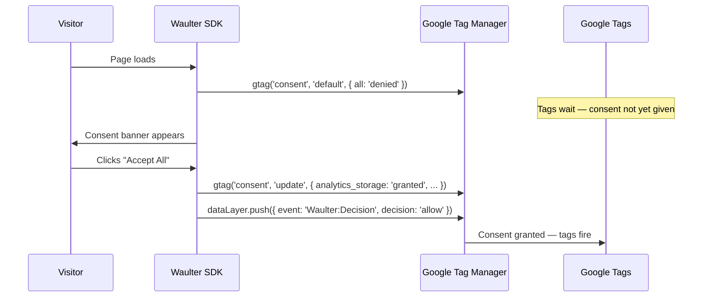

# Getting Started

Waulter is a hosted **Consent Management Platform (CMP)** that collects, stores, and signals user consent across your web properties. It ships as a lightweight JavaScript SDK that you deploy through Google Tag Manager or a direct script tag.

## What you get

| Capability | Description |
|-----------|-------------|
| **Consent Banner** | A fully customisable, GDPR-compliant consent banner that renders on your site and collects visitor consent decisions. |
| **Preference Centre** | A detailed view where visitors can review and change their consent choices at any time. |
| **Google Consent Mode v2** | Automatic integration with GCM v2 — the SDK sets default denied signals on page load and updates them after the visitor decides. |
| **Consent Statistics** | A dashboard showing consent rates, decision breakdowns, and visitor trends per configuration. |
| **Policy Document Hosting** | Render versioned Cookie Policy and Privacy Policy documents directly on your pages — update text in the dashboard, no code deploy needed. |
| **Scenario Targeting** | Serve different consent experiences based on URL patterns, user type, campaign, or any custom context. |
| **Cross-Domain Consent** | User Sharing lets visitors consent once and have the decision honoured across your entire domain portfolio. |

## Who this documentation is for

| Audience | Start here |
|----------|-----------|
| **Developers** integrating Waulter into a website | [Quick Start](quick-start.md) and [Implementation Guides](../implementation/index.md) |
| **Tag managers** deploying via GTM | [GTM Implementation](../implementation/gtm/index.md) |
| **DPOs / compliance officers** configuring consent | [Dashboard](../dashboard/index.md) and [Purposes](../features/purposes.md) |
| **Agency administrators** managing client sites | [Agency Guide](../agency/index.md) |

## How it works — at a glance

1. The SDK loads and immediately sets all Google consent signals to **denied**.
2. If the visitor has no stored consent, the banner appears.
3. When the visitor makes a choice, the SDK updates consent signals and pushes a `Waulter:Decision` event to the data layer.
4. Tags controlled by consent triggers fire (or remain blocked) accordingly.
5. The consent decision is stored so returning visitors are not prompted again. The SDK persists consent in a first-party cookie (`vaswaulter`) and `localStorage`, and each interaction is recorded as a [Permission Transaction](../features/permission-tx.md) — a unique, auditable proof-of-consent. See [Waulter Cookies](../features/cookies.md) for full details on what is stored and for how long.

!!! tip "Overriding stored consent with Scenarios"
    By default, returning visitors with valid stored consent skip the banner entirely. However, you can override this using a [Scenario](../dashboard/scenarios.md) with the **forceStartCB** flag — this forces the banner to appear again under conditions you define (e.g. after a policy update, for a specific URL pattern, or when purposes change). See [Scenarios — forceStartCB](../dashboard/scenarios.md#the-forcestartcb-flag) for details, and [Scenario-Driven Engagement](../good-practices/scenario-engagement.md) for creative business use cases like whitepaper gates, loyalty programs, and post-purchase opt-ins.

## Next steps

-   :material-clock-fast: **Quick Start**

    Deploy a consent banner in 5 minutes via GTM.

    [:octicons-arrow-right-24: Quick Start](quick-start.md)

-   :material-book-open-variant: **Key Concepts**

    Learn the core vocabulary: configurations, purposes, scenarios, and consent signals.

    [:octicons-arrow-right-24: Concepts](concepts.md)

-   :material-code-tags: **SDK Reference**

    Explore the public JavaScript API.

    [:octicons-arrow-right-24: SDK](../sdk/index.md)

-   :material-cog: **Dashboard Guide**

    Configure purposes, styling, texts, and compliance settings.

    [:octicons-arrow-right-24: Dashboard](../dashboard/index.md)

