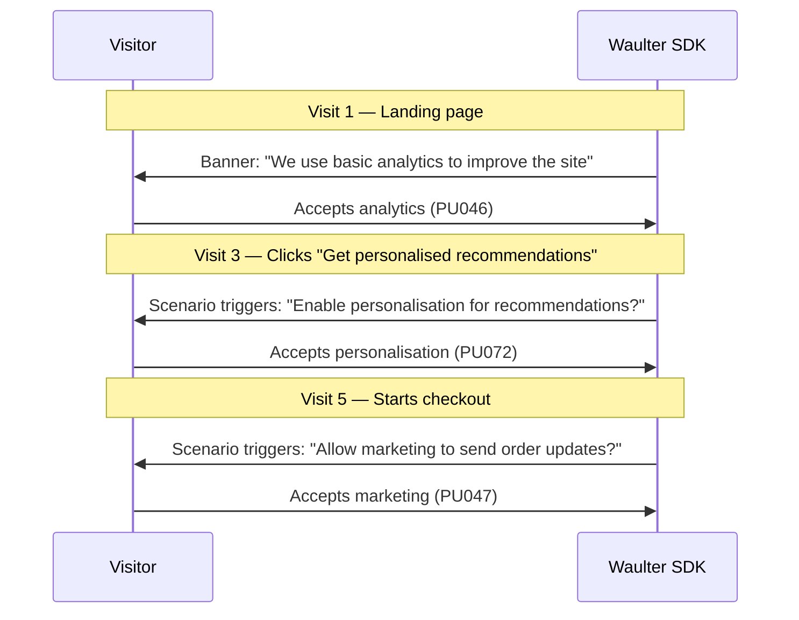

# Consent Strategy — Running Permissions

If you operate in an industry where **trust is scarce** — healthcare, finance, legal services, government — or if your consent rates are persistently low, the "all-or-nothing" banner approach may be working against you. Users who distrust blanket requests will reject everything.

The solution: treat consent like a conversation, not a checkbox.

## The problem with "wall of consent"

A standard cookie banner presents all purposes at once: analytics, marketing, personalisation, A/B testing. For a first-time visitor who doesn't yet trust your brand, this feels like a demand — and the rational response is to reject everything.

**Typical result:**

- 30-40% reject rate on first visit
- Marketing and analytics data heavily degraded
- No opportunity to demonstrate value before asking for trust

## The "running permissions" model

Mobile apps solved this years ago. They don't ask for camera, location, contacts, and notifications all at once. They ask for each permission **at the moment the user needs the feature** — and the accept rate is dramatically higher because the request makes sense in context.

You can apply the same pattern with Waulter using [Scenarios](../dashboard/scenarios.md) and purpose-level consent.

### How it works

1. **Start minimal** — your default configuration only asks for essential + basic analytics (the least controversial purposes)
2. **Earn trust first** — let visitors use your site, read your content, experience your service
3. **Ask contextually** — when the visitor triggers a feature that requires additional consent, use a scenario to prompt them for just that purpose

### Implementation with Scenarios

**Step 1: Minimal default configuration**

Create your base configuration with only essential + analytics purposes. This is what every visitor sees on first visit.

**Step 2: Feature-triggered scenarios**

Create scenario rules that detect when a visitor needs a specific feature:

| Trigger | Scenario Rule | Purpose to Request |
|---------|--------------|-------------------|
| Visitor clicks "Recommendations" | `url contains /recommendations` | Personalisation |
| Visitor opens chat widget | `customField1 equals "chat-opened"` | Functionality |
| Visitor starts checkout | `url contains /checkout` | Marketing (order comms) |
| Visitor views 10+ pages | `pageview > 10` | Extended analytics |

Each scenario uses `forceStartCB: true` to show a **contextual, single-purpose prompt** — not the full banner.

**Step 3: Custom banner text per purpose**

Each triggered configuration has text that explains **why** this specific permission matters for what the user is trying to do:

- *"To show you personalised recommendations, we need to track your browsing preferences. Allow personalisation?"*
- *"To send you order updates and delivery notifications, we need marketing permissions. Allow?"*

## Why it works

| Factor | Wall of Consent | Running Permissions |
|--------|----------------|-------------------|
| **Timing** | Asks before any value delivered | Asks when user needs the feature |
| **Context** | Generic legal language | Tied to a specific user action |
| **Scope** | All purposes at once | One purpose at a time |
| **User control** | Binary (accept all / reject all) | Granular, progressive |
| **Trust signal** | "We want all your data" | "We ask only when you need it" |
| **Typical accept rate** | 55-65% (all purposes) | 70-85% (per purpose, contextual) |

## Industries where this matters most

- **Healthcare** — patients are highly sensitive about data; ask for analytics only after they've used the portal
- **Financial services** — trust is earned over transactions; request marketing consent after the first successful operation
- **Legal services** — clients expect discretion; start with zero optional tracking, add only on explicit request
- **Government / public sector** — citizens expect minimal data collection; each additional purpose needs strong justification
- **E-commerce with low brand awareness** — new visitors don't know you yet; earn trust through browsing, then ask

## Measuring the impact

Track your running permissions strategy through [Statistics](../dashboard/statistics.md):

1. **Per-purpose consent rate** — should be higher than all-at-once rates
2. **Consent funnel** — how many visitors progress from basic to full consent over time
3. **Feature adoption** — does contextual consent increase feature usage?

## Audit trail integrity

Every contextual consent prompt generates its own [Permission Transaction](../features/permission-tx.md) — the audit trail shows exactly when each purpose was consented to, in which context, with which configuration text. This is actually **stronger** compliance evidence than a single "accept all" interaction, because it demonstrates that each purpose was individually and contextually consented to.

!!! tip "Start small, measure, iterate"
    You don't need to implement running permissions for every purpose at once. Start with one high-value use case (e.g. personalisation on the recommendations page), measure the contextual accept rate vs your baseline, and expand from there.
