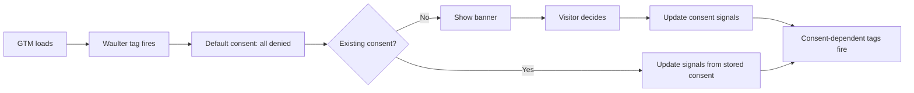

# Google Tag Manager

Google Tag Manager (GTM) is the **recommended deployment method** for most websites. It lets you add Waulter without modifying your site's source code and provides built-in consent management support.

## Why GTM?

| Benefit | Description |
|---------|-------------|
| **No code deploy** | Add and update the consent banner from the GTM UI — no developer needed for changes |
| **Consent Mode integration** | GTM natively understands consent signals, allowing tags to wait for consent before firing |
| **Consent Initialization trigger** | GTM provides a special trigger that fires Waulter before any other tags |
| **Preview & debug** | Test your consent setup in GTM's Preview mode before publishing |
| **Version control** | GTM maintains a version history of all container changes |

## Two approaches

There are two ways to deploy Waulter through GTM. Choose the one that fits your level of control:

| Approach | Control level | Best for |
|----------|--------------|----------|
| **Community Template + Scaffold** | Standard — pre-built triggers, variables, and consent gating | Most implementations, quick setup, teams that prefer visual configuration |
| **Custom HTML** | Full — you control every tag firing decision | Strict compliance requirements, complex integrations, custom loading strategies |

!!! tip "Regulated industries"
    If your business handles sensitive data (healthcare, finance) or operates in a heavily regulated industry, consider the Custom HTML approach for maximum control over which tags fire for which purposes. See [Why purpose-level control matters](custom-html.md#why-purpose-level-control-matters).

### Community Template + Scaffold (recommended)

The **Waulter Community Template** provides a point-and-click interface for SDK configuration. The **GTM Scaffold** adds pre-built variables and triggers for purpose-level consent control.

- No custom code required
- 79 variables + 17 triggers + 2 tags, pre-wired
- Category-level and purpose-level consent gating
- Quick setup — import and configure

[:octicons-arrow-right-24: Community Template Guide](community-template.md)
[:octicons-arrow-right-24: GTM Scaffold Guide](scaffold.md)

### Custom HTML Tag

A **Custom HTML tag** gives you full control over SDK initialisation, loading order, and advanced patterns like `appendDocument`.

- Custom timing and loading strategies
- Purpose-level tag firing logic you write yourself
- Integration with existing consent stacks
- Dynamic configuration from server-side rendering

[:octicons-arrow-right-24: Custom HTML Guide](custom-html.md)

## Prerequisites

Before you start, ensure you have:

- [x] A **Waulter account** with a configured website
- [x] Your **Configuration ID** (e.g. `AG0000`) or **Scenario ID** (e.g. `SC00009`)
- [x] A **GTM container** installed on your website
- [x] Your domain added to the **Whitelisted Domains** list in the Waulter dashboard

## How the SDK integrates with GTM

When you set `useGtm: true` in your configuration, the SDK automatically:

1. **Defines `window.gtag`** if not already present (as a `dataLayer.push` wrapper)
2. **Pushes `gtm.init_consent`** to signal consent initialisation
3. **Sets default consent** — all Google consent signals to `denied`
4. **Pushes lifecycle events** — `Waulter:Loaded`, `Waulter:Open`, `Waulter:Decision`, `Waulter:Closed`
5. **Updates consent signals** via `gtag('consent', 'update', ...)` when the visitor decides



## Using consent triggers for other tags

After Waulter is deployed, you can control when other tags fire based on the visitor's consent decision.

### Example: Fire Google Analytics only after consent

1. In GTM, create a **Custom Event** trigger with event name `Waulter:Decision`.
2. Add a condition: use a Custom JavaScript Variable to check if analytics purposes are accepted.
3. Assign this trigger to your GA4 Configuration tag.

```javascript
// GTM Custom JavaScript Variable: "Waulter - web analysis allowed?"
function() {
  var purposes = {{Waulter_Purposes}};
  if (Array.isArray(purposes)) {
    return purposes.includes("PU061") ||
           purposes.includes("PU046") ||
           purposes.includes("PU050");
  }
  return false;
}
```

See [Events & Data Layer](../../features/events.md) for the full list of events and purpose codes.

## Importing the scaffold

The **Waulter GTM Scaffold** is a downloadable GTM container export (JSON) with 79 variables, 17 triggers, and 2 tags — all pre-wired for Waulter consent control.

1. Download `waulter_gtm_scaffold.json` from the [Waulter GTM GitHub repository](https://github.com/Consentizer/Waulter-CMP-Google-Tag-Manager)
2. In GTM, go to **Admin** > **Import Container**
3. Choose **Merge** > **Rename conflicting tags, triggers, and variables**
4. Review and confirm

[:octicons-arrow-right-24: Full scaffold documentation](scaffold.md)

!!! tip "Review before publishing"
    After importing, review all tags, triggers, and variables in GTM Preview mode before publishing. Rename any items to match your naming conventions.
