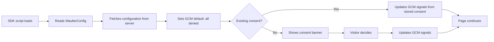

# Implementation

Waulter can be deployed in several ways. Choose the approach that fits your technical setup and team.

## Comparison

| Approach | Best for | Flexibility | Code required? |
|----------|----------|-------------|---------------|
| **GTM Community Template** | Most teams | High (point-and-click) | No |
| **GTM Custom HTML** | Advanced GTM users | Full | Minimal |
| **Direct script tag** | Headless CMS, SSR apps, custom stacks | Full | Yes |
| **Platform-specific** | Webflow, WordPress | Moderate | Minimal |

## GTM Community Template (recommended)

The fastest path — install the official Waulter template from the GTM Template Gallery. No code required.

[:octicons-arrow-right-24: GTM Community Template](gtm/community-template.md)

## GTM Custom HTML

Full control over SDK initialisation using a Custom HTML tag. Use this for advanced patterns like `appendDocument`, dynamic custom fields, or integration with existing consent logic.

[:octicons-arrow-right-24: GTM Custom HTML](gtm/custom-html.md)

## Direct Script Tag

Add the SDK directly to your HTML. Works with any website — static HTML, server-rendered apps, headless CMS, or SPAs.

[:octicons-arrow-right-24: Direct Script Tag](direct/index.md)

## Platform guides

| Platform | Guide |
|----------|-------|
| Webflow | [Webflow Integration](platforms/webflow.md) |
| WordPress | [WordPress Integration](platforms/wordpress.md) |

## How the SDK initialises

Regardless of deployment method, the SDK follows the same initialisation flow:

## Prerequisites

Before deploying, ensure you have:

- [x] A **Waulter account** with access to the dashboard
- [x] A **Configuration ID** (e.g. `AG0000`) or **Scenario ID** (e.g. `SC00009`)
- [x] Your domain added to the **Whitelisted Domains** list in the dashboard
- [x] Access to your website's code or tag manager

See [Getting Started](../getting-started/index.md) for a full orientation.
